# Недра

Fabric-мод для **Minecraft 1.21.11**: мир становится на 288 блоков глубже, а подземелье
превращается в отдельное приключение. Чем ниже вы спускаетесь, тем сильнее давит порода,
тем ценнее руды и тем опаснее своды.

| | |
|---|---|
|  |  |
| Руды и блоки мода, манометр давления справа внизу | Шахтёрская каска, усиленный шлем, шлем скафандра |
|  |  |
| Предметы мода | Справочник: ярусы давления |
|  |  |
| Дно мира без защиты: критическое давление | То же место в шлеме скафандра |
| 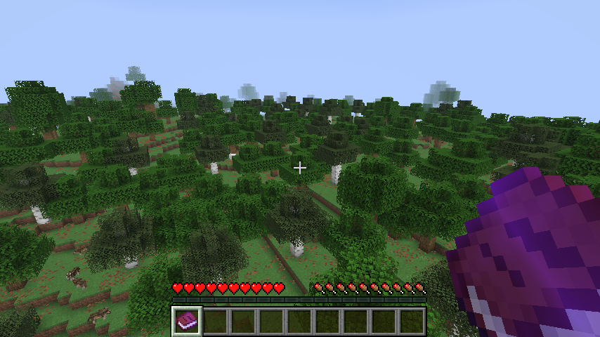 | 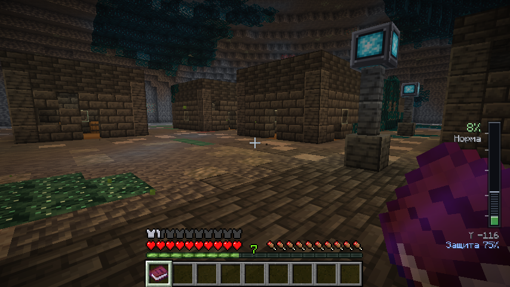 |
| Обычный мир на поверхности | Заброшенный город шахтёров |
| 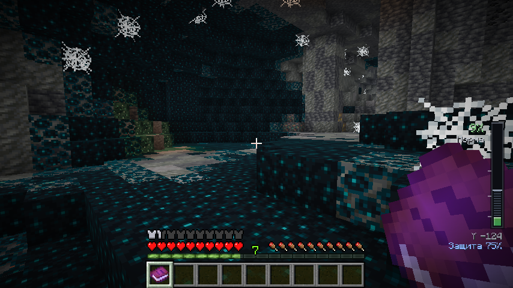 | 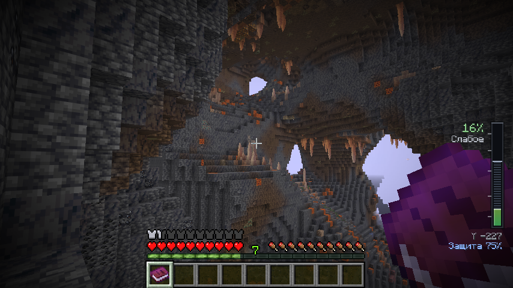 |
| Эхо-пустоты | Магнитные пещеры |
| 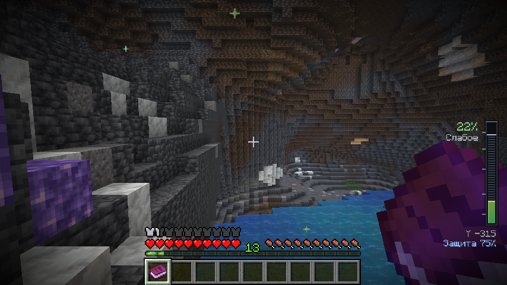 | 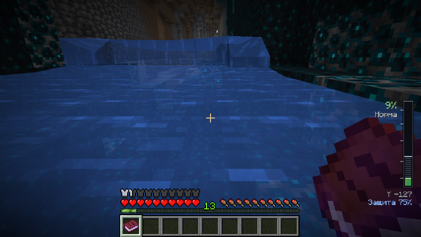 |
| Кристальные глубины | Подземная река |
| 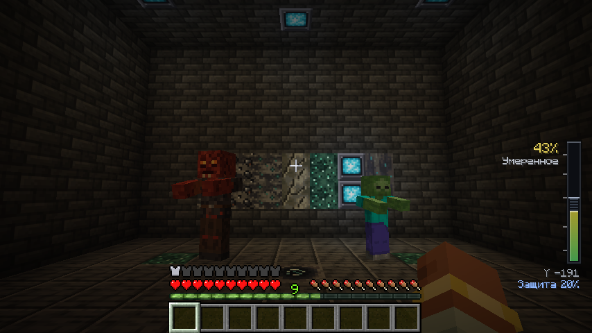 | 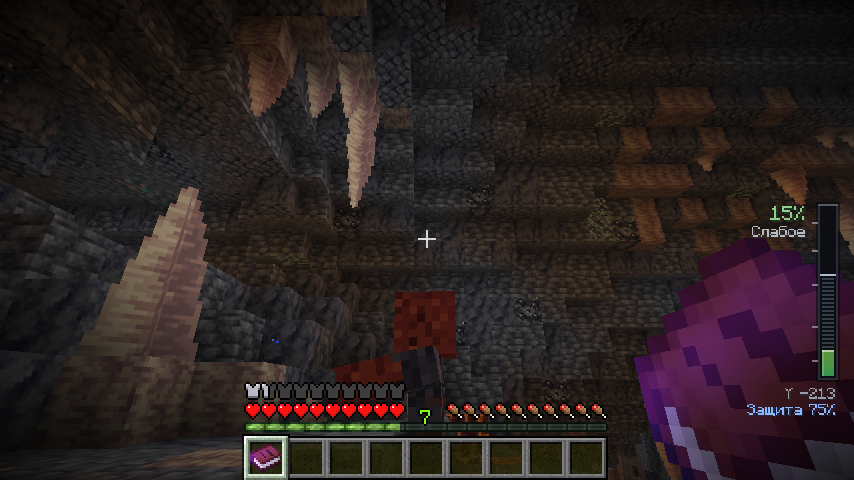 |
| Ржавый громила рядом с обычным зомби | Громила, сам появившийся в Магнитных пещерах |
| 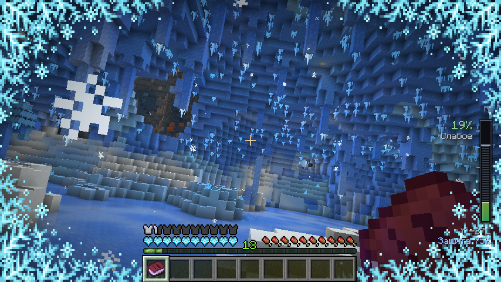 | 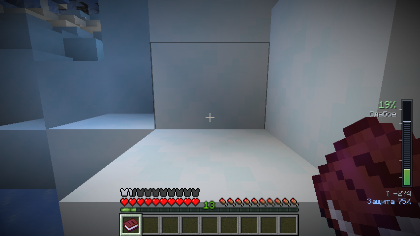 |
| Замёрзшая пещера | Брошенный лагерь экспедиции |
| 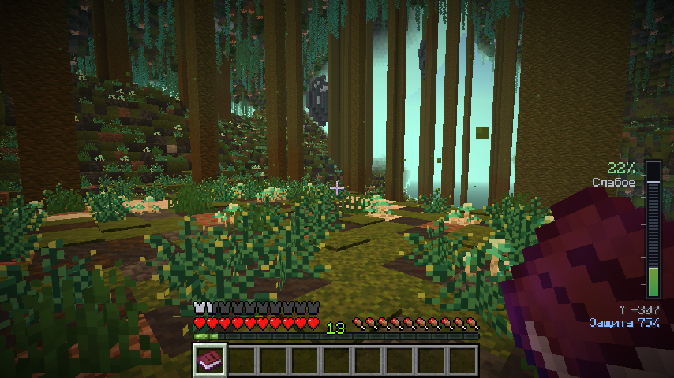 | 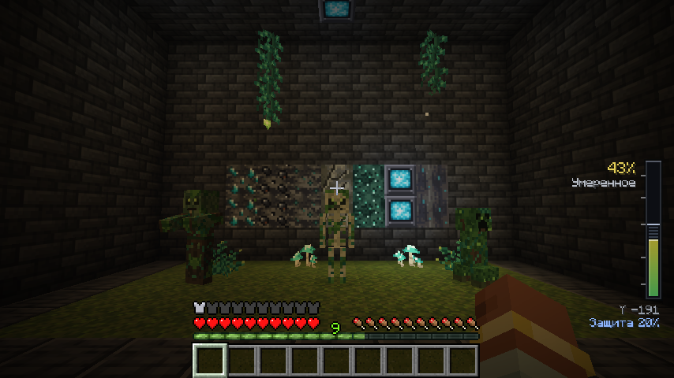 |
| Заросшие глубины: болото, мох, стволы, лианы | Заросшие зомби, скелет и крипер |
| 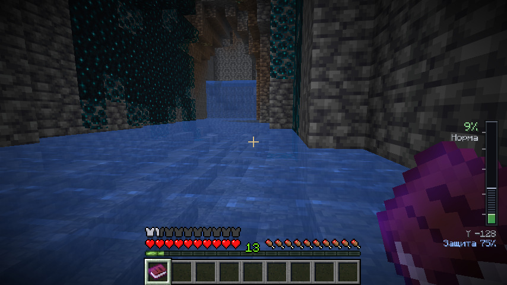 | 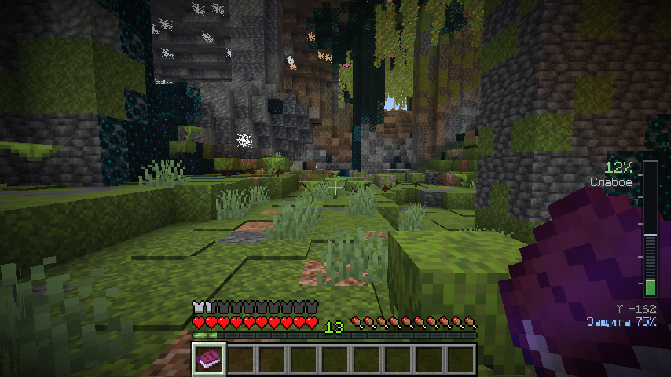 |
| Водопад подземной реки | Пышная пещера на глубине около −180 |
| 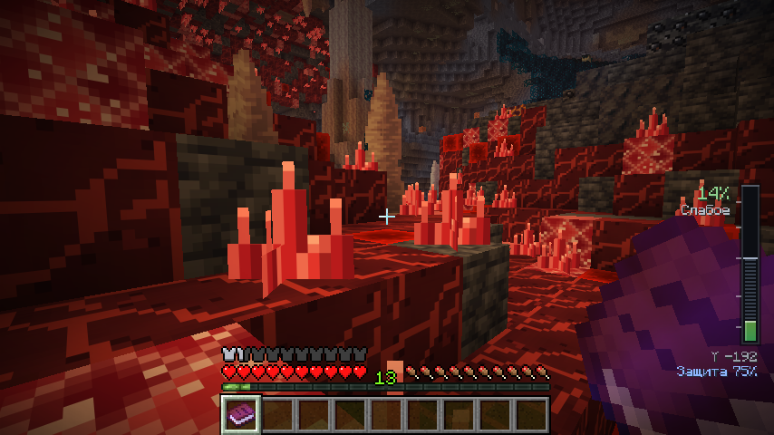 | 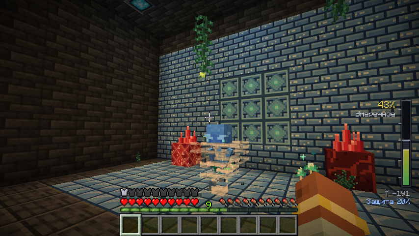 |
| Алые гроты | Хрустальный вихрь — страж цитадели |
| 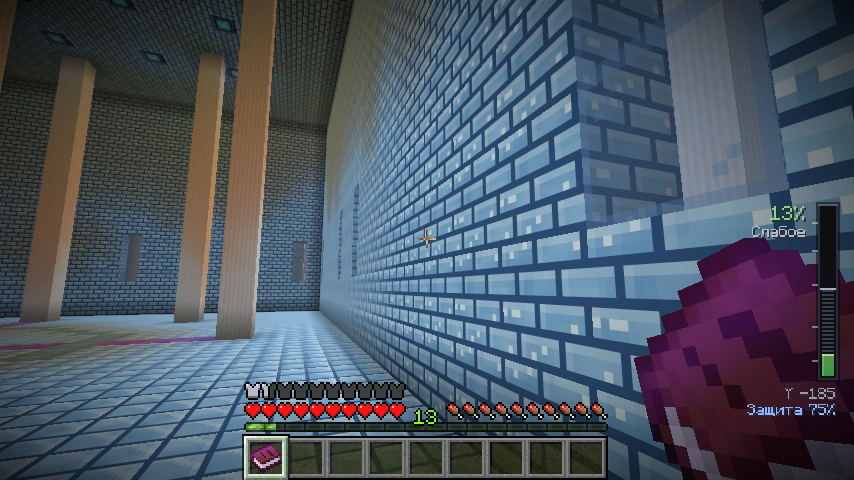 | 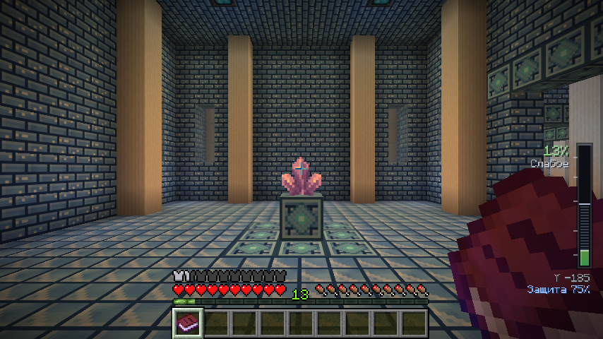 |
| Сердце Хрустальной цитадели | Залы цитадели |

*Скриншоты сняты автоматически в настоящем игровом клиенте (см. «Сборка и проверка»).*

## Что нового в 1.7.0

- **Новый биом — Замёрзшие пещеры.** Редкие ледяные залы (примерно как древние города: одна пещера на
  несколько сотен блоков, и то не везде) на **случайной высоте** — от самого дна недр до глубины в пару
  десятков блоков под поверхностью. Пещера всегда целиком под землёй и обходит крепости, древние города
  и испытательные камеры.
  - несколько слившихся ледяных куполов высотой 26–38 блоков со сводом из плотного и синего льда;
  - **огромные сосульки** (до двух третей высоты зала), ледяные колонны от пола до свода и ледяные шипы;
  - **ледопады** — застывшие водопады у стен с наледью у подножия;
  - **озеро подо льдом** (вода не утекает, на дне светятся кристаллы), **снежные островки** на нём;
  - **ледяные деревья**: стволы из плотного льда, ветви из синего, крона из ледяной листвы со снегом
    и свисающими прядями;
  - **голубое освещение**: кристаллы инея на своде и полу, морские фонари в толще льда, голубой туман
    и падающие снежинки, музыка заснеженных вершин;
  - сугробы, рыхлый снег (осторожно!), туннели наружу с инеем на стенах;
  - **брошенный лагерь экспедиции**: палатка, сундук и бочка с припасами, погасший костёр, фонарь.
- **Новые блоки и предметы:** кристалл инея (свет 10, даёт осколки инея), сосулька, ледяная листва,
  **морозный светильник** (4 осколка инея вокруг плотного льда; светит на 11 и не топит лёд и снег).
- **Новый моб — обмороженный шахтёр:** удар промораживает (иней на экране и замедление), от холода
  спасает кожаная броня. Там же появляются зимогоры и светящиеся спруты в озере.
- Достижение «Вечная мерзлота», `/nedra locate frozen_caverns`, страницы 23–24 справочника.

## Что нового в 1.6.1

- Хрустальные вихри спокойнее: спавнер выпускает двоих примерно раз в минуту и не больше трёх рядом
  (действует и на спавнеры в уже созданных мирах), здоровья у стража вдвое меньше (18), заряды ветра
  откидывают заметно слабее.

## Что нового в 1.6.0

- **Руды.** Уголь, железо, медь и алмазы теперь есть в открытых жилах на стенах пещер во всех биомах
  недр; жил стало больше, изредка попадаются целые алмазные пласты. Глубинные алмазы больше не
  «прячутся» от воздуха. Ванильные руды на обычных высотах — как в обычном Майнкрафте.
- **Реки с течением и водопадами.** Подземные реки стали длиннее и реже, вода спускается ступенями по
  5 блоков — на каждой ступени настоящий водопад. Течение сносит игрока, предметы, лодки и мобов вниз
  по реке (против течения плыть можно, но медленно).
- **Пышные пещеры на глубине** −140…−215 (редко): мох, азалии, большие капельники, лозы со
  светящимися ягодами, спороцветы — настоящий ванильный биом пышных пещер с аксолотлями.
- **Шахты** встречаются в 2,75 раза чаще и стоят на любой высоте — от поверхности до самого дна.
- **Новый биом — Алые гроты** около Y −200: небольшие редкие залы из алого камня с алыми кристаллами
  и друзами (дают алые осколки), много красного камня.
- **Хрустальная цитадель** — подземный замок-лабиринт на Y −110…−255: 36 залов, проходы-лабиринт,
  сокровищницы, библиотеки, сады, посты стражи со спавнерами и высокое Сердце с огромным кристаллом
  и сундуками награды. Стерегут **хрустальные вихри** — синие, быстрее и крепче ванильного вихря.
- `/nedra locate waterfall|lush_pocket|scarlet_grottoes|citadel`, страницы 20–22 справочника,
  достижения «Красный свет» и «Буря в хрустале».

## Что нового в 1.5.0

- **Новый биом — Заросшие глубины.** Самый нижний ярус (ниже Y −272) теперь делят Кристальные глубины
  и подземные джунгли: широкие залы с болотами (уровень воды около Y −321), мох, грязь и корневая земля,
  стволы древних деревьев от пола до свода, комья листвы, кувшинки, водоросли и глиняное дно, на котором
  живут аксолотли. Кваканье лягушек, споры в воздухе, музыка пышных пещер.
- **Новые растения:** *глубинная лиана* (свисает со свода, по ней можно лазить, на кончике иногда
  светится спора), *глубинный папоротник*, *светошляпка* (светящиеся грибы).
- **Жители зарослей** — мшистые версии мобов, появляются только здесь:
  - *заросший зомби* — удар отравляет спорами на 2 секунды, не тонет в утопленника;
  - *заросший скелет* — стрелы опутывают (замедление на 3 секунды);
  - *заросший крипер* — после взрыва вокруг воронки прорастают мох, папоротник и светошляпки
    (если включено `mobGriefing`).
  Никто из них не горит на солнце; роняют лианы и светошляпки.
- Достижение «Зелёная тьма», `/nedra locate overgrown_depths`, страницы 18–19 справочника.
- Рудные жилы на стенах пещер, глубинный уголь и больше руд ниже −64 (из прошлого обновления);
  манометр давления виден в творческом режиме с пометкой «Без эффекта».

## Что нового в 1.4.0

- **Новый моб — ржавый громила.** Зомби-шахтёр, проржавевший в железистой породе Магнитных пещер:
  красный, на треть крупнее обычного зомби (30 здоровья, 4 урона, броня 4), медленнее его. Тяжёлый
  удар на 2 секунды замедляет. Не горит на солнце, не бывает детёнышем и не зовёт подкрепление.
  Появляется в темноте только в *Магнитных пещерах* (Y −176…−272), по одному-двое.
  Роняет гнилую плоть, сырое железо и иногда сырой магнетит; изредка держит каменную кирку.
- Яйцо призыва во вкладке «Недра», достижение «Ржавчина не спит», страница 17 справочника.

## Что нового в 1.3.0

- **Новые недра.** Пещеры ниже Y −64 теперь цельная система, которая тянется через множество чанков,
  и у каждого биома своя форма и отделка:
  - *Эхо-пустоты* — огромные плоские залы с каменными колоннами, туф, гравий, скалк, паутина;
  - *Магнитные пещеры* — высокие шахты и разломы, базальт, магма, выходы магнетита, сталактиты;
  - *Кристальные глубины* — гигантские камеры из кальцита и аметиста с друзами, светящимся люменитом,
    жеодами и подземными озёрами.
- **Подземные реки** — две сети рек (около Y −116 и Y −228), туннели с водой на сотни блоков.
- **Заброшенные города шахтёров** — огромный зал с домами, улицами, фонарями, колодцем на площади
  и сундуками с припасами (примерно одно поселение на 300×300 блоков, в половине таких областей).
- **Ванильные руды в глубинном сланце** ниже −64: железо, золото, редстоун, лазурит, медь, изумруды
  и алмазы (крупные алмазные жилы — на самой глубине).
- **`/nedra locate settlement|river|echo_hollows|magnetic_caverns|crystal_depths`** — найти ближайшее
  место (для операторов).

## Что нового в 1.2.0

- **Исправлена генерация мира.** Поверхность и обычные глубины снова ванильные: никаких гигантских
  провалов, лавовых и водных морей. Ванильные руды (алмазы, редстоун и т. д.), жеоды, данжи и пещеры
  остались на своих ванильных высотах.
- **Недра ниже Y −64** — отдельный слой: свои пещеры и ущелья, лава только у самого дна, каверны,
  реки, озёра и поселения.
- **Биомы по ярусам:** Эхо-пустоты (Y −80…−176), Магнитные пещеры (Y −176…−272),
  Кристальные глубины (ниже −272). Каждый биом занимает часть своего яруса, между ними — обычные пещеры.
- **Давление начинается с Y 0**, и манометр появляется только ниже нуля (старый `config/nedra.json`
  обновляется автоматически).

## Что нового в 1.1.0

- **Исправления:** шлемы получили нормальную прочность, зачарования и починку; давление больше не
  действует в Нижнем мире, Энде и творческом режиме; вместо «Усталости» — мягкое замедление добычи;
  урон от давления больше не обходит механику здоровья; справочник не выдаётся заново после
  перезапуска; компас вдали от магнетита сам приходит в норму; обвалы не ломают сундуки и жидкости;
  воздушные разломы действительно подбрасывают игрока; в поселениях появились свет и лут;
  перекраска биомов сохраняется в мире и не тормозит большие миры.
- **Интерфейс:** новый манометр с анимацией и штриховкой защиты, виньетка в такт сердцу, помехи F3,
  подсказки к предметам, субтитры, полная локализация RU/EN, справочник на 16 страниц, команды `/nedra`.
- **Контент:** люменитовый светильник, магнетитовый слиток, рецепты с книгой рецептов, лут с
  «Удачей» и «Шёлковым касанием», дерево достижений, магнитные каверны, туман/частицы/звуки биомов.
- **Оформление:** новые текстуры всех блоков и предметов, модели брони, иконка, звуковые эффекты.

## Установка

| Что | Версия |
|---|---|
| Minecraft | 1.21.11 |
| Fabric Loader | 0.19.5 или новее |
| Fabric API | 0.141.6+1.21.11 или новее |
| Java | 21+ |

Положите `nedra-1.7.0.jar` (готовая сборка лежит в `dist/nedra-mod.jar`) и Fabric API в папку
`mods`. Мод нужен и на сервере, и у каждого игрока.

> **Высота мира.** Мод опускает дно Верхнего мира с -64 до **-352**. На новом мире всё работает
> штатно. На существующем мире новые глубины появятся только в ещё не сгенерированных чанках —
> **сделайте резервную копию мира** перед первым запуском.

## Возможности

### Давление
- Выше Y 0 мир обычный. Ниже нуля начинаются недра: давление растёт от 0% до 100% на дне мира (Y -352). Как только вы опускаетесь ниже нуля, справа внизу появляется манометр:
  шкала с плавной анимацией, ярус, высота и текущая защита. Часть давления, которую «съедает»
  защита, показана штриховкой.
- Пять ярусов: **Слабое** (10%+), **Умеренное** (30%+, добыча медленнее), **Сильное** (55%+,
  стон породы и помехи на экране F3), **Опасное** (75%+, стук сердца и тёмная виньетка в такт ему),
  **Критическое** (92%+, порода ранит, но никогда не добивает).
- Замедление добычи — модификатор атрибута, а не статус-эффект: оно не мигает иконкой и
  снимается сразу, как только вы поднимаетесь.
- Давление действует только в Верхнем мире и не трогает игроков в творческом режиме и наблюдателей.

### Защита и снаряжение
| Предмет | Защита | Рецепт |
|---|---|---|
| Шахтёрская каска | 20% | 4 железных слитка + кристалл люменита |
| Усиленный шахтёрский шлем | 45% | каска + 5 магнетитовых слитков |
| Шлем глубинного скафандра | 75% | усиленный шлем + 5 магнетита + стекло + 2 резонансных осколка |
| Таблетка от давления | +25% на 3:00 | 2 пучка глубинного мха + сахар → 2 шт. |

Шлемы — полноценная броня: прочность, зачарования, починка на наковальне, отображение на
модели игрока. Таблетку можно пить и на сытый желудок; её защита складывается со шлемом
(суммарно не больше 95%).

### Опасности
- **Обвалы.** Нестабильный камень сыплет пылью. Копать рядом опасно: свод трещит, и через
  2 секунды на место добычи падают камни. Ниже Y 0 своды изредка рушатся и без него.
  Контейнеры, жидкости и прочные блоки не обрушиваются никогда.
- **Воздушные разломы.** Разлом в полу пещеры бьёт струёй воздуха вверх, подбрасывает игрока и
  гасит урон от падения — природный лифт. Заложите разлом блоком, и поток стихнет.

### Руды
- **Люменит** (ниже Y -32) — светящаяся руда, кристаллы для каски и светильника.
- **Магнетит** (ниже Y -64) — сырьё для шлемов и геофона. Сбивает обычный компас: рядом с рудой
  стрелка беспорядочно вертится, а вдали от неё компас сам приходит в норму.
- **Эхо-руда** (ниже Y -96) — её проще услышать, чем увидеть: рядом звучит тихий хрустальный звон.
- **Геофон** простукивает породу в радиусе 32 блоков: сила сигнала, тип руды, направление
  (по горизонтали и по вертикали) и расстояние, а ответное эхо приходит со стороны находки.

Все руды учитывают «Шёлковое касание» и «Удачу», требуют железную кирку и дают опыт.

### Подземный мир
- **Три биома по ярусам глубины** (Y −80…−176, −176…−272, ниже −272) со своим туманом, частицами и звуками:
  *Кристальные глубины* (аметист и люменит в стенах огромных каверн),
  *Магнитные пещеры* (магнетит, базальт и туф), *Эхо-пустоты* (пепел, тишина и брошенные залы).
- **Гигантские каверны**, **подземные реки**, которые петляют вверх и вниз между пластами,
  **озёра** и редкие **подземные океаны**.
- **Заброшенные поселения** — цепочки вырубленных залов с мебелью, светильниками и сундуками
  с припасами.
- **Ржавый громила** — крупный красный зомби-шахтёр, живёт в Магнитных пещерах.
- **Заросшие глубины** — подземные джунгли с болотами на самом дне мира, свои растения и мшистые
  зомби, скелеты и криперы.
- **Замёрзшие пещеры** — редкие ледяные залы на любой высоте: сосульки, ледопады, озёра подо льдом,
  ледяные деревья и обмороженные шахтёры.
- Светящийся **глубинный мох** на полу пещер — сырьё для таблеток (подходит для компостера).

### Интерфейс и контент
- Полная локализация на русский и английский: предметы, подсказки с реальными числами из
  конфига сервера, субтитры всех звуков, сообщение о смерти, команды.
- **Справочник шахтёра** (24 страницы) выдаётся каждому игроку один раз; цифры на страницах
  берутся из настроек сервера.
- **Достижения**: отдельная вкладка «Недра» — от первого спуска ниже нуля до дна мира,
  от каски до скафандра и испытание «Три мира под землёй».
- Все рецепты открываются в книге рецептов, как только у игрока появляется нужный ингредиент.
- Собственные текстуры, модели брони, иконка мода и синтезированные звуковые эффекты.

## Команды

| Команда | Кто | Что делает |
|---|---|---|
| `/nedra info` | все | высота, давление с защитой и без, защита, ярус |
| `/nedra guide` | все | выдать справочник ещё раз |
| `/nedra locate …` | операторы | ближайшее поселение, река, водопад, цитадель, замёрзшая пещера, пышная пещера или биом недр |
| `/nedra reload` | операторы | перечитать `config/nedra.json` без перезапуска |

## Настройки

Файл `config/nedra.json` создаётся при первом запуске сервера. Некорректные значения
исправляются автоматически (с предупреждением в логе).

| Параметр | По умолчанию | Смысл |
|---|---|---|
| `surfaceY` / `deepY` | 0 / -352 | высоты нулевого и максимального давления |
| `helmetLightReductionPercent` | 20 | защита каски, % |
| `helmetReinforcedReductionPercent` | 45 | защита усиленного шлема, % |
| `helmetDeepsuitReductionPercent` | 75 | защита шлема скафандра, % |
| `tabletReductionPercent` / `tabletDurationTicks` | 25 / 3600 | действие таблетки |
| `miningSlowdownStartTier` / `miningSlowdownPerTier` | 2 / 0.12 | с какого яруса и насколько замедляется добыча |
| `damageStartTier` / `damageAmount` / `damageIntervalTicks` | 5 / 2.0 / 40 | урон от давления (не опускает здоровье ниже 1) |
| `rockfallCheckRadius` / `rockfallChancePerCheck` / `rockfallWarningDelayTicks` | 6 / 0.06 / 40 | обвалы |
| `currentLiftStrength` / `currentColumnHeight` | 0.11 / 7 | воздушные разломы |
| `geophoneRadius` / `geophoneCooldownTicks` | 32 / 40 | геофон |
| `magnetiteInterferenceRadius` | 8 | радиус помех компасу |
| `pressureUpdateIntervalTicks` | 10 | как часто сервер пересчитывает давление |

## Сборка и проверка

```bash
./gradlew build                                    # build/libs/nedra-1.0.0.jar
./gradlew runClientGameTest -PnedraClientTest      # игровой клиент + скриншоты (нужен дисплей или xvfb)
```

В репозитории настроены проверки GitHub Actions:
- **Build Nedra Mod** — сборка при каждом изменении и обновление `dist/nedra-mod.jar`;
- **Verify Nedra Runtime** — запуск настоящего сервера 1.21.11: загрузка всех данных, рецептов,
  достижений и генерация мира;
- **Nedra Client Screenshots** — запуск настоящего клиента под виртуальным дисплеем: на двух
  глубинах строится зал из блоков мода и снимаются скриншоты HUD, текстур, брони, инвентаря и
  справочника (`docs/screenshots/`).

## Технические детали

- Высота мира: в `data/minecraft/` переопределены только `dimension_type` и `noise_settings` (высота
  и нижняя граница), рельеф не тронут. Ванильные фичи и вырезатели, привязанные к дну мира
  (`above_bottom`), закреплены на ванильных абсолютных высотах, поэтому обычный мир совпадает с ванильным.
- Недра ниже Y −64 заполняют собственные вырезатели (`nedra:deep_cave`, `nedra:deep_canyon`) и фичи.
  Последний шаг генерации чанка (`nedra:deep_layers`) осушает в них лаву, которой ванильный акифер
  заливает любые полости ниже Y −54, и расставляет биомы ярусов.
- Каверны, реки, озёра, океаны и поселения — собственные `Feature`, подключённые через
  `BiomeModifications`; разломы и мох ставятся `environment_scan` строго на пол пещер.
- Биомы перекрашиваются тем же механизмом, что и `/fillbiome` (`Chunk#populateBiomes`).
  Фичи генерации только ставят заявку в потокобезопасную очередь; серверный поток хранит заявки
  в сохранении мира, применяет их при загрузке чанка и сразу отправляет клиентам новые биомы.
- Поиск руды геофоном и помехи компаса используют палитру секций чанка (`ChunkSection#hasAny`) —
  секции без нужного блока отбрасываются целиком, поэтому проверка почти бесплатна.
- Помехи компаса — ванильное состояние «маяк потерян» (`lodestone_tracker` без цели) плюс
  собственный компонент-метка `nedra:magnetized`, по которому мод снимает подмену; настоящие
  компасы, привязанные к магнетиту, никогда не трогаются.
- Звон эхо-руды и частицы блоков — клиентский `randomDisplayTick`, без тикающих блок-сущностей.
- Помехи F3 рисуются миксином в конце `DebugHud#render`, остальной HUD — через
  `HudElementRegistry` Fabric API.
