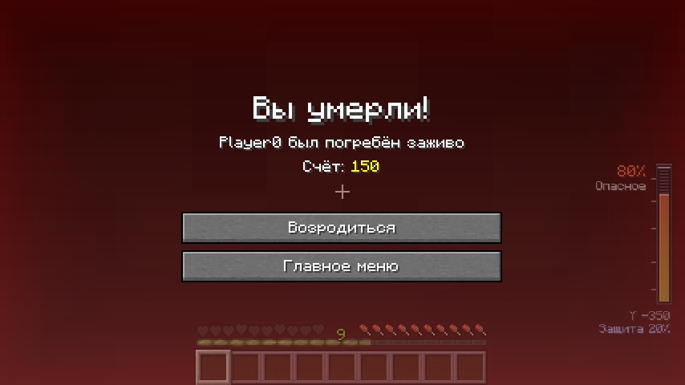
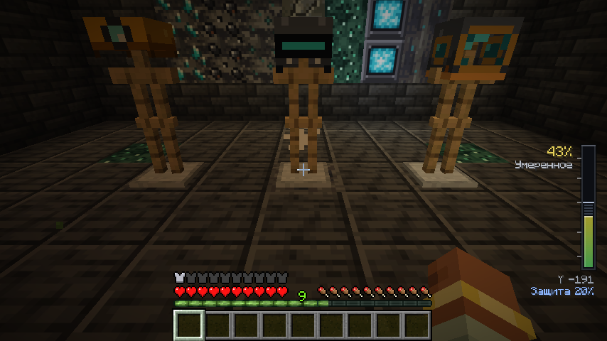
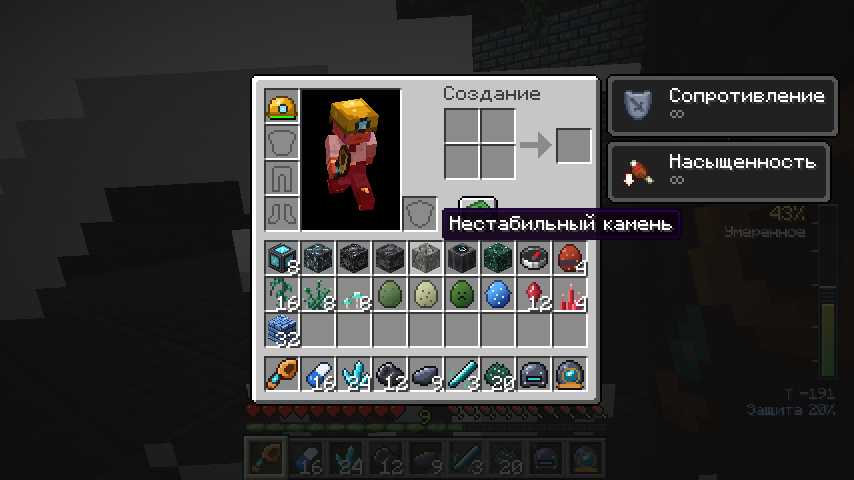
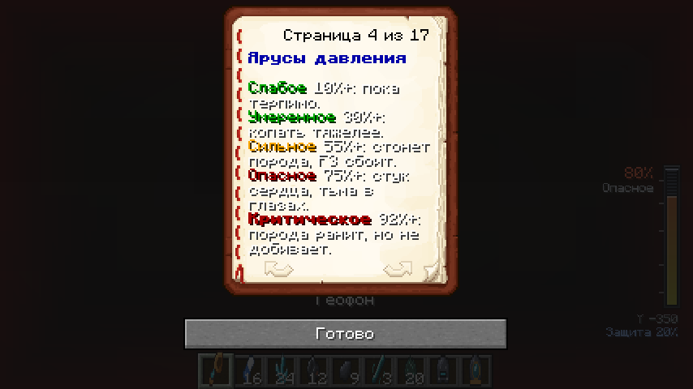
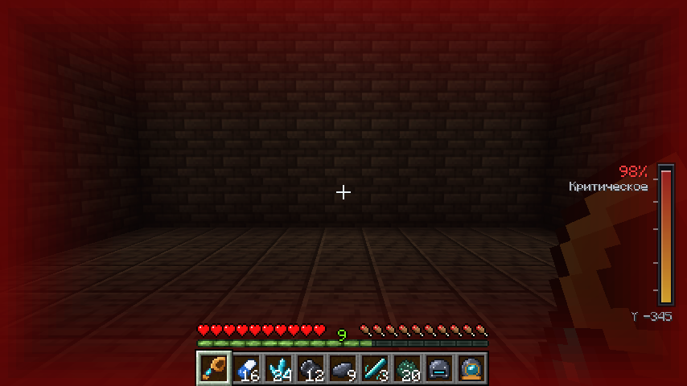
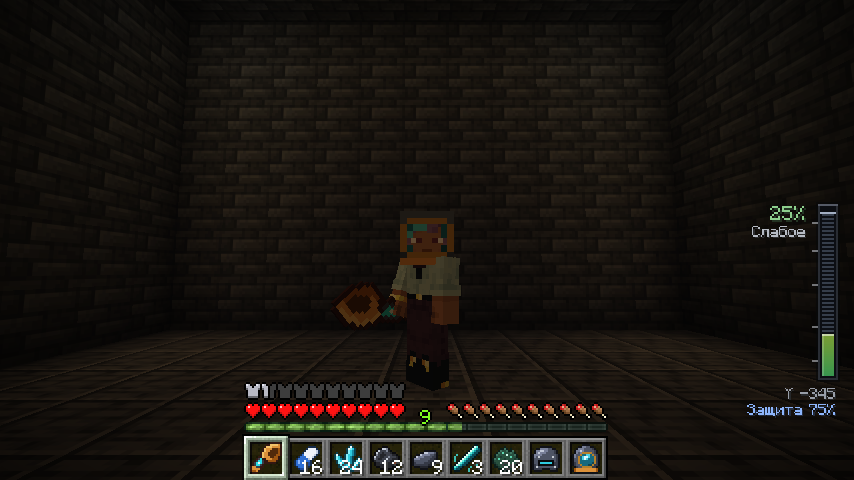

# Недра

Fabric-мод для **Minecraft 1.21.11**: мир становится на 288 блоков глубже, а подземелье
превращается в отдельное приключение. Чем ниже вы спускаетесь, тем сильнее давит порода,
тем ценнее руды и тем опаснее своды.

| | |
|---|---|
|  |  |
| Руды и блоки мода, манометр давления справа внизу | Шахтёрская каска, усиленный шлем, шлем скафандра |
|  |  |
| Предметы мода | Справочник: ярусы давления |
|  |  |
| Дно мира без защиты: критическое давление | То же место в шлеме скафандра |

*Скриншоты сняты автоматически в настоящем игровом клиенте (см. «Сборка и проверка»).*

## Установка

| Что | Версия |
|---|---|
| Minecraft | 1.21.11 |
| Fabric Loader | 0.19.5 или новее |
| Fabric API | 0.141.6+1.21.11 или новее |
| Java | 21+ |

Положите `nedra-1.0.0.jar` (готовая сборка лежит в `dist/nedra-mod.jar`) и Fabric API в папку
`mods`. Мод нужен и на сервере, и у каждого игрока.

> **Высота мира.** Мод опускает дно Верхнего мира с -64 до **-352**. На новом мире всё работает
> штатно. На существующем мире новые глубины появятся только в ещё не сгенерированных чанках —
> **сделайте резервную копию мира** перед первым запуском.

## Возможности

### Давление
- Давление растёт от 0% у поверхности до 100% на дне мира. Справа на экране — манометр:
  шкала с плавной анимацией, ярус, высота и текущая защита. Часть давления, которую «съедает»
  защита, показана штриховкой.
- Пять ярусов: **Слабое** (10%+), **Умеренное** (30%+, добыча медленнее), **Сильное** (55%+,
  стон породы и помехи на экране F3), **Опасное** (75%+, стук сердца и тёмная виньетка в такт ему),
  **Критическое** (92%+, порода ранит, но никогда не добивает).
- Замедление добычи — модификатор атрибута, а не статус-эффект: оно не мигает иконкой и
  снимается сразу, как только вы поднимаетесь.
- Давление действует только в Верхнем мире и не трогает игроков в творческом режиме и наблюдателей.

### Защита и снаряжение
| Предмет | Защита | Рецепт |
|---|---|---|
| Шахтёрская каска | 20% | 4 железных слитка + кристалл люменита |
| Усиленный шахтёрский шлем | 45% | каска + 5 магнетитовых слитков |
| Шлем глубинного скафандра | 75% | усиленный шлем + 5 магнетита + стекло + 2 резонансных осколка |
| Таблетка от давления | +25% на 3:00 | 2 пучка глубинного мха + сахар → 2 шт. |

Шлемы — полноценная броня: прочность, зачарования, починка на наковальне, отображение на
модели игрока. Таблетку можно пить и на сытый желудок; её защита складывается со шлемом
(суммарно не больше 95%).

### Опасности
- **Обвалы.** Нестабильный камень сыплет пылью. Копать рядом опасно: свод трещит, и через
  2 секунды на место добычи падают камни. Ниже Y 0 своды изредка рушатся и без него.
  Контейнеры, жидкости и прочные блоки не обрушиваются никогда.
- **Воздушные разломы.** Разлом в полу пещеры бьёт струёй воздуха вверх, подбрасывает игрока и
  гасит урон от падения — природный лифт. Заложите разлом блоком, и поток стихнет.

### Руды
- **Люменит** (ниже Y -32) — светящаяся руда, кристаллы для каски и светильника.
- **Магнетит** (ниже Y -64) — сырьё для шлемов и геофона. Сбивает обычный компас: рядом с рудой
  стрелка беспорядочно вертится, а вдали от неё компас сам приходит в норму.
- **Эхо-руда** (ниже Y -96) — её проще услышать, чем увидеть: рядом звучит тихий хрустальный звон.
- **Геофон** простукивает породу в радиусе 32 блоков: сила сигнала, тип руды, направление
  (по горизонтали и по вертикали) и расстояние, а ответное эхо приходит со стороны находки.

Все руды учитывают «Шёлковое касание» и «Удачу», требуют железную кирку и дают опыт.

### Подземный мир
- **Три биома** со своим туманом, частицами и звуками:
  *Кристальные глубины* (аметист и люменит в стенах огромных каверн),
  *Магнитные пещеры* (магнетит, базальт и туф), *Эхо-пустоты* (пепел, тишина и брошенные залы).
- **Гигантские каверны**, **подземные реки**, которые петляют вверх и вниз между пластами,
  **озёра** и редкие **подземные океаны**.
- **Заброшенные поселения** — цепочки вырубленных залов с мебелью, светильниками и сундуками
  с припасами.
- Светящийся **глубинный мох** на полу пещер — сырьё для таблеток (подходит для компостера).

### Интерфейс и контент
- Полная локализация на русский и английский: предметы, подсказки с реальными числами из
  конфига сервера, субтитры всех звуков, сообщение о смерти, команды.
- **Справочник шахтёра** (16 страниц) выдаётся каждому игроку один раз; цифры на страницах
  берутся из настроек сервера.
- **Достижения**: отдельная вкладка «Недра» — от первого спуска ниже нуля до дна мира,
  от каски до скафандра и испытание «Три мира под землёй».
- Все рецепты открываются в книге рецептов, как только у игрока появляется нужный ингредиент.
- Собственные текстуры, модели брони, иконка мода и синтезированные звуковые эффекты.

## Команды

| Команда | Кто | Что делает |
|---|---|---|
| `/nedra info` | все | высота, давление с защитой и без, защита, ярус |
| `/nedra guide` | все | выдать справочник ещё раз |
| `/nedra reload` | операторы | перечитать `config/nedra.json` без перезапуска |

## Настройки

Файл `config/nedra.json` создаётся при первом запуске сервера. Некорректные значения
исправляются автоматически (с предупреждением в логе).

| Параметр | По умолчанию | Смысл |
|---|---|---|
| `surfaceY` / `deepY` | 62 / -352 | высоты нулевого и максимального давления |
| `helmetLightReductionPercent` | 20 | защита каски, % |
| `helmetReinforcedReductionPercent` | 45 | защита усиленного шлема, % |
| `helmetDeepsuitReductionPercent` | 75 | защита шлема скафандра, % |
| `tabletReductionPercent` / `tabletDurationTicks` | 25 / 3600 | действие таблетки |
| `miningSlowdownStartTier` / `miningSlowdownPerTier` | 2 / 0.12 | с какого яруса и насколько замедляется добыча |
| `damageStartTier` / `damageAmount` / `damageIntervalTicks` | 5 / 2.0 / 40 | урон от давления (не опускает здоровье ниже 1) |
| `rockfallCheckRadius` / `rockfallChancePerCheck` / `rockfallWarningDelayTicks` | 6 / 0.06 / 40 | обвалы |
| `currentLiftStrength` / `currentColumnHeight` | 0.11 / 7 | воздушные разломы |
| `geophoneRadius` / `geophoneCooldownTicks` | 32 / 40 | геофон |
| `magnetiteInterferenceRadius` | 8 | радиус помех компасу |
| `pressureUpdateIntervalTicks` | 10 | как часто сервер пересчитывает давление |

## Сборка и проверка

```bash
./gradlew build                                    # build/libs/nedra-1.0.0.jar
./gradlew runClientGameTest -PnedraClientTest      # игровой клиент + скриншоты (нужен дисплей или xvfb)
```

В репозитории настроены проверки GitHub Actions:
- **Build Nedra Mod** — сборка при каждом изменении и обновление `dist/nedra-mod.jar`;
- **Verify Nedra Runtime** — запуск настоящего сервера 1.21.11: загрузка всех данных, рецептов,
  достижений и генерация мира;
- **Nedra Client Screenshots** — запуск настоящего клиента под виртуальным дисплеем: на двух
  глубинах строится зал из блоков мода и снимаются скриншоты HUD, текстур, брони, инвентаря и
  справочника (`docs/screenshots/`).

## Технические детали

- Высота мира: `dimension_type`, `noise_settings` и две density-функции Верхнего мира
  переопределены в `data/minecraft/`, чтобы рельеф и пещеры «дотянулись» до новой глубины.
- Каверны, реки, озёра, океаны и поселения — собственные `Feature`, подключённые через
  `BiomeModifications`; разломы и мох ставятся `environment_scan` строго на пол пещер.
- Биомы перекрашиваются тем же механизмом, что и `/fillbiome` (`Chunk#populateBiomes`).
  Фичи генерации только ставят заявку в потокобезопасную очередь; серверный поток хранит заявки
  в сохранении мира, применяет их при загрузке чанка и сразу отправляет клиентам новые биомы.
- Поиск руды геофоном и помехи компаса используют палитру секций чанка (`ChunkSection#hasAny`) —
  секции без нужного блока отбрасываются целиком, поэтому проверка почти бесплатна.
- Помехи компаса — ванильное состояние «маяк потерян» (`lodestone_tracker` без цели) плюс
  собственный компонент-метка `nedra:magnetized`, по которому мод снимает подмену; настоящие
  компасы, привязанные к магнетиту, никогда не трогаются.
- Звон эхо-руды и частицы блоков — клиентский `randomDisplayTick`, без тикающих блок-сущностей.
- Помехи F3 рисуются миксином в конце `DebugHud#render`, остальной HUD — через
  `HudElementRegistry` Fabric API.
